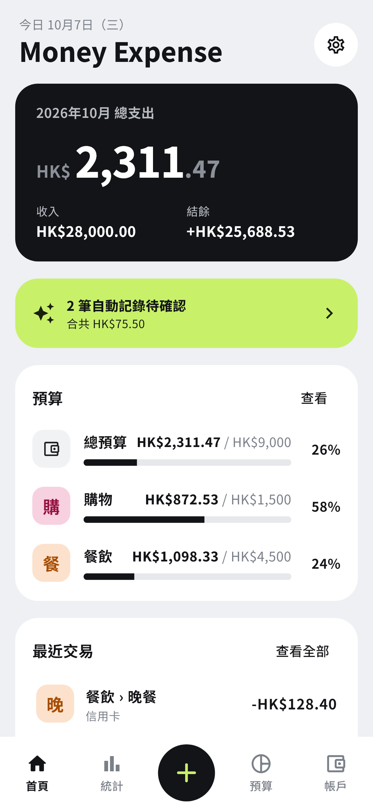
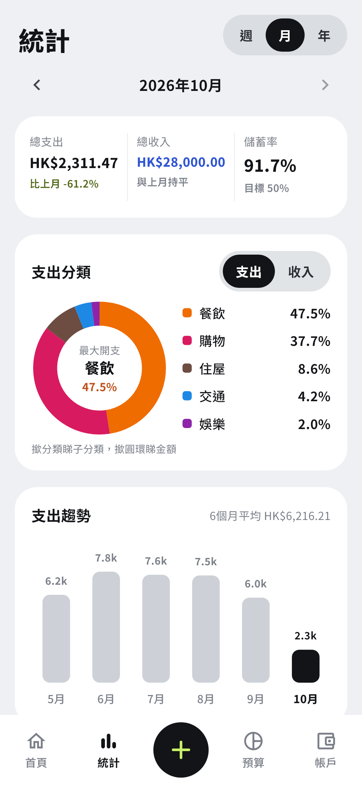
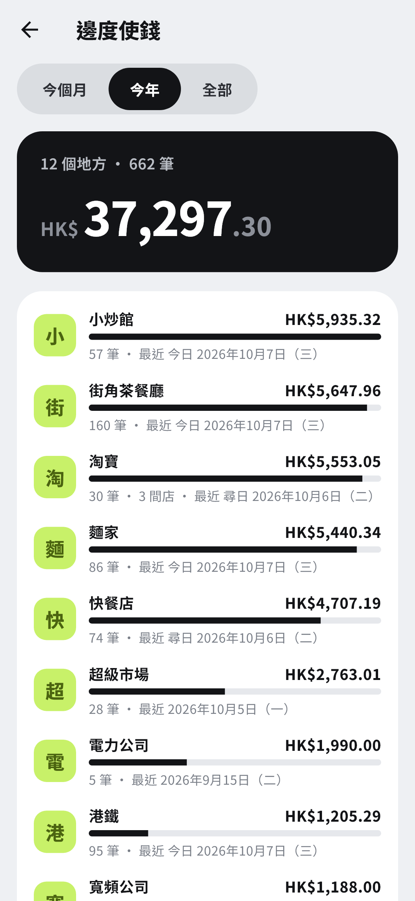
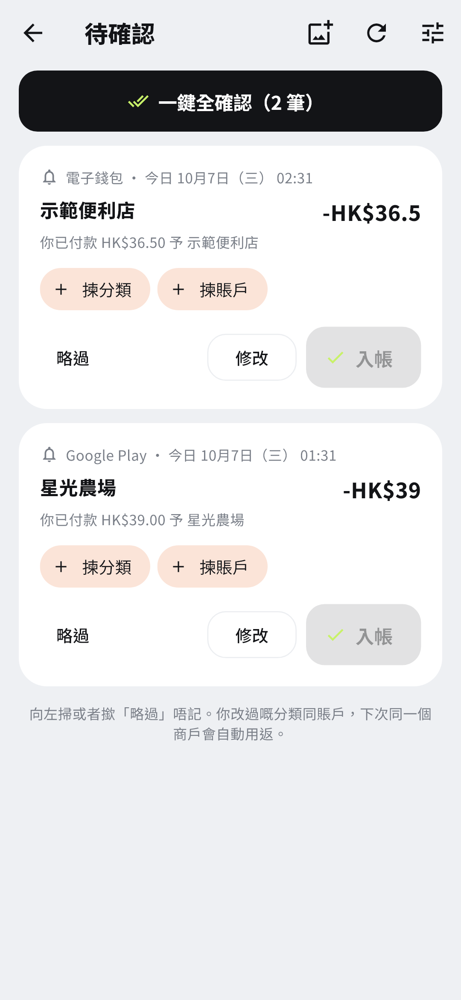
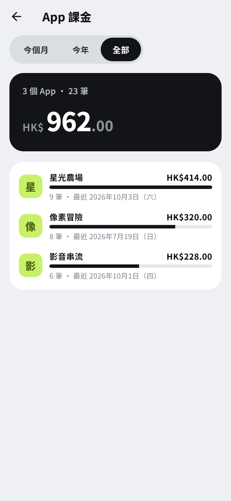
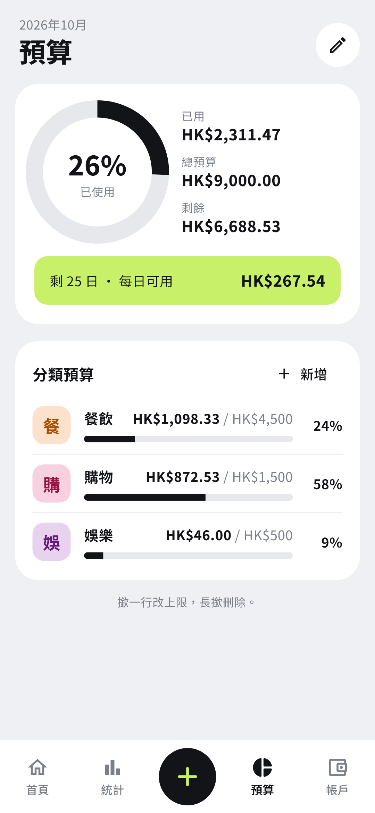
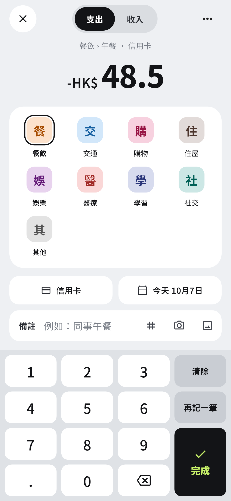

<div align="center">


# Money Expense

**支出を自動で記録してくれる、プライバシー重視の Android 家計簿アプリ。**

[](https://github.com/HKmario852/money-manager/releases/latest)
[](https://github.com/HKmario852/money-manager/releases)
[](https://github.com/HKmario852/money-manager/actions/workflows/ci.yml)


[English](../../README.md) · [繁體中文](README.zh-TW.md) · [简体中文](README.zh-CN.md) · **日本語** · [한국어](README.ko.md) · [Español](README.es.md)

  

</div>

> [!NOTE]
> アプリの画面は**繁体字中国語（広東語）のみ**です。香港向けに作られており、通貨は既定で香港ドル、AlipayHK・オクトパス・タオバオに対応しています。

<details>
<summary>その他のスクリーンショット</summary>
<br>
<p align="center">




</p>
<p align="center"><sub>スクリーンショットは <a href="../../tool/screenshots/screenshots_test.dart">tool/screenshots</a> が架空のデモデータから生成しています。</sub></p>
</details>

## ✨ 機能

- 🔔 **支払いを自動で記録**：支払い通知を読み取ります（AlipayHK、Google Play、Google Wallet、オクトパス、WeChat Pay、HSBC、または許可した任意のアプリ）。新しい支払いは「確認待ち」に入り、1 件ずつでもまとめてでも確定できます。
- 📧 **Gmail のレシート**：自分の Google アカウント内で動く Apps Script 経由で取り込みます。スクリプトはアプリが用意するので、貼り付けるだけです。
- 🎮 **Google Play の購入履歴**：Google Takeout の zip を取り込み、アプリやゲームごとの支出を確認できます。
- 🛍️ **タオバオの注文**：タオバオの「导出订单」の Excel か JSON エクスポートを取り込み、注文日ごとのレートで人民元から香港ドルに換算します。商品明細も保存し、エクスポートに画像があれば表示します。
- 🚇 **オクトパス**：スマホの NFC でカードの残高を読み取るか、オクトパスアプリのスクリーンショットを Gemini で読み取ります。
- 📊 **お金の使い道**：カテゴリ・週・月・年ごとの統計、お店や場所ごと、アプリごとの支出。
- 🎯 **予算**：月全体とカテゴリごとに設定でき、1 日あたりあといくら使えるかも表示します。
- ⌨️ **すばやい手入力**：テンキー、タグ、テンプレート、レシート写真。
- 🔒 **プライバシー**：データは端末内だけに保存。指紋ロックや、パスワードで AES 暗号化したバックアップも使えます。
- ⬆️ **アプリ内アップデート**：このリポジトリの GitHub Releases から更新できます。

## 📥 ダウンロード

1. [**Releases**](https://github.com/HKmario852/money-manager/releases/latest) から最新の `.apk` をダウンロードします。
2. Android スマホで開き、ブラウザまたはファイルマネージャーからのインストールを許可します。
3. 新しいバージョンは **設定 › 檢查更新** に表示され、データを残したまま上書きインストールできます。

> [!WARNING]
> このアプリは Google Play で配布していません。通知へのアクセスを求めるため、Google Play プロテクトが警告したりブロックしたりすることがあります。インストール後に通知へのアクセスを有効にできない場合は、Android の設定でこのアプリのページを開き、**制限付き設定を許可**を選んでください。

## 🚀 クイックスタート

1. **初回起動**：通貨を選び、最初の口座（例：現金）を作成します。
2. **自動記録をオンにする**：**設定 › 自動記錄** で通知へのアクセスを許可し、読み取ってよい支払いアプリを選びます。
3. **支払いを確定する**：アプリを開くたびに新しい支払いを取り込みます。ホームの **待確認** から確定してください。選んだカテゴリと口座は、次回から同じお店に自動で使われます。
4. **任意のインポート**（すべて **設定 › 自動記錄** にあります）：
   - Gmail のレシート
   - Play の購入履歴を含む Google Takeout の zip
   - タオバオの注文ファイル
5. **使い道を見る**：**統計** で全体を、**邊度使錢** でお店ごとに、**App 課金** でアプリへの支出を確認できます。

## ⚙️ 設定

すべて任意で、アプリの **設定 › 自動記錄** から設定します。

| 設定 | 内容 |
| --- | --- |
| 通知へのアクセス | 支払い通知を読み取れるようにします。Android のみ。 |
| 許可するアプリ | これらのアプリの通知だけを保存します。ほかのアプリは選べるように名前だけ表示します。 |
| Gmail のレシート | 自分の Google アカウントにデプロイする Apps Script を用意します。アプリはスクリプトの検索条件に合うレシートを取得します。 |
| Gemini API キー | 組み込みルールで認識できない通知やメール、オクトパスのスクリーンショットを読み取ります。キーは Android のセキュアストレージに保存されます。⚠️ Gemini は一部の地域（例：香港）では使えません。 |
| 自動確定 | お店のカテゴリと口座がすでに分かっている場合、確認なしで記録します。 |

## 🛠️ ソースからビルド

[Flutter SDK](https://docs.flutter.dev/get-started/install)（stable チャンネル）と Android SDK が必要です。

```bash
git clone https://github.com/HKmario852/money-manager.git
cd money-manager
flutter pub get
dart run build_runner build --delete-conflicting-outputs
flutter test
flutter run                 # 接続したスマホやエミュレーターで実行
flutter build apk --release
```

`android/key.properties` がない場合、release ビルドはデバッグキーで署名されるため、公式リリースに上書きインストールできません。署名・CI・スクリーンショット・コード構成は [docs/DEVELOPMENT.md](../DEVELOPMENT.md)（英語）を参照してください。

## 🧰 技術スタック

- **言語と UI**：[Flutter](https://flutter.dev) と Dart、Material 3。
- **状態管理**：[Riverpod](https://riverpod.dev)。
- **ストレージ**：[Drift](https://drift.simonbinder.eu)（SQLite）、複式簿記。
- **Android ネイティブ（Kotlin）**：通知の読み取り、オクトパス NFC、アプリアイコン。
- **リリース**：`main` へのプッシュごとに GitHub Actions がテスト・ビルドし、署名済み APK を公開します。

## 🔐 プライバシー

- 記録・レシート・設定は**端末内だけ**に保存されます。Android のシステムバックアップはオフなので、データの移行にはアプリのバックアップ機能を使ってください。
- アカウント登録も分析もありません。アプリがインターネットに接続するのは次の場合だけです。
  - GitHub Releases での更新確認
  - 任意の Gmail スクリプトと Gemini
  - Google Play や App Store からのアプリアイコン取得
  - 人民元→香港ドルの為替レート（[frankfurter.dev](https://frankfurter.dev)、[open.er-api.com](https://open.er-api.com)）
  - タオバオの商品画像
- 通知の内容は、許可したアプリのものだけを保存します。

> [!IMPORTANT]
> これは個人プロジェクトで、銀行や金融商品ではありません。通知やレシートの読み取りはベストエフォートなので、金額の取りこぼしや読み間違いがありえます。記録内容は必ず確認してください。Google Play、タオバオ、AlipayHK、オクトパスなどの名称は各社の商標であり、このアプリはいずれとも関係ありません。

## 📄 ライセンス

**ライセンスはまだありません**。すべての権利は作者に帰属します。コードを読むことはできますが、再利用には許可が必要です。

[Flutter](https://flutter.dev)、[Drift](https://drift.simonbinder.eu)、[Riverpod](https://riverpod.dev)、[fl_chart](https://pub.dev/packages/fl_chart)、[Material Symbols](https://fonts.google.com/icons) を使って作られています。為替レートは[欧州中央銀行（Frankfurter 経由）](https://frankfurter.dev)のものです。
